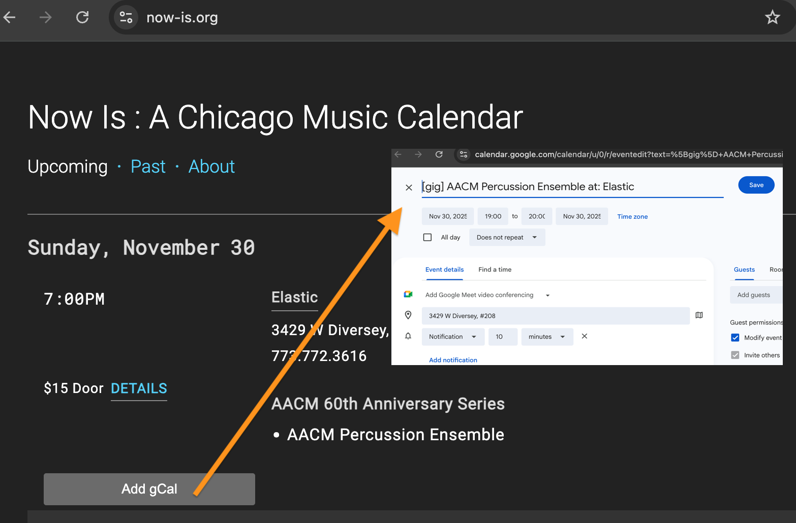

# add concerts from now-is.org to your calendar (Chrome Plugin, using Google Calendar)

This is a Google Chrome plugin that finds events at the amazing
[Now Is Calendar](https://now-is.org) and adds a button so that you can add them to your calendar (currently only supports google calendar API). 

Once you click on the ``add gCal`` button below any event, it will open a new tab in your browser to handle a new google calendar event corresponding to this event.

## How to install? 

This is not being offered in the Chrome store. So you should install it manually by: 
1. Open ``chrome://extensions/`` on your browser
2. On the corner enable "developer mode"
3. Now you can do "Load unpacked"
4. And select the directory containing the code of this repository. 
5. It will now appear on your chrome "All Extensions" tab.
6. If needed, enable it as you would a normal extension. 
7. It only operates on the ``https://now-is.org/`` URL, so navigate to the [Now Is Calendar](https://now-is.org) page and you should see the buttons. 
8. Test it by pressing one.

## How to configure?
 
The settings panel (via ``Chrome's extension manager`` at ``chrome://extensions/``, then ``details`` of this extension, then ``Extension options``) allows you to configure:

  * ``tag``: add a tag (e.g., "[gig]") to the title of any of your calendar events.
  * ``calendar``: the ID of a google calendar if you do not want this to add it to your default. To obtain this ID, go to your desired calendar in ``Google Calendar``, then ``settings`` and then search for ``Integrate calendar`` and then copy the ``Calendar ID`` (including the long string of characters and the ``@group.calendar.google.com`` portion).
  * ``debug``: a checkbox to enable debugging on this extension. This log is accessible via Chrome's ``inspector`` ``console``.

